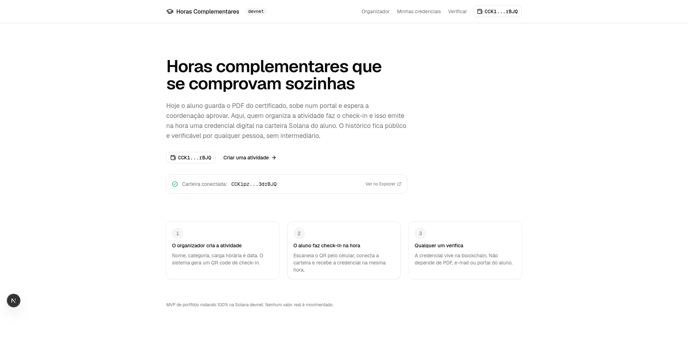
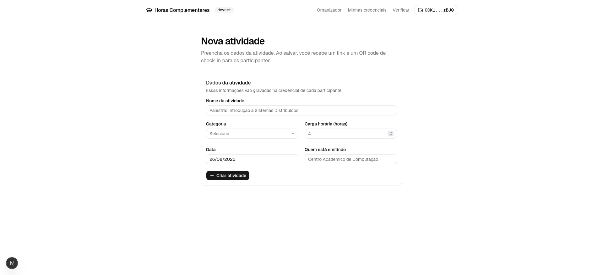
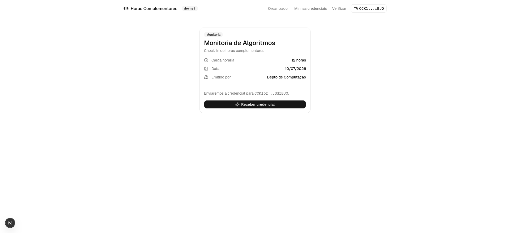
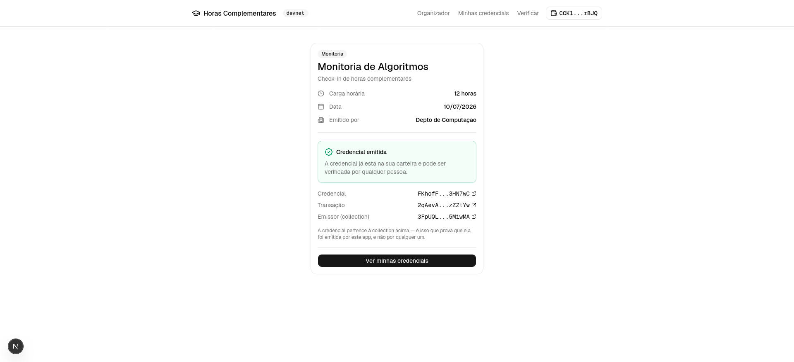
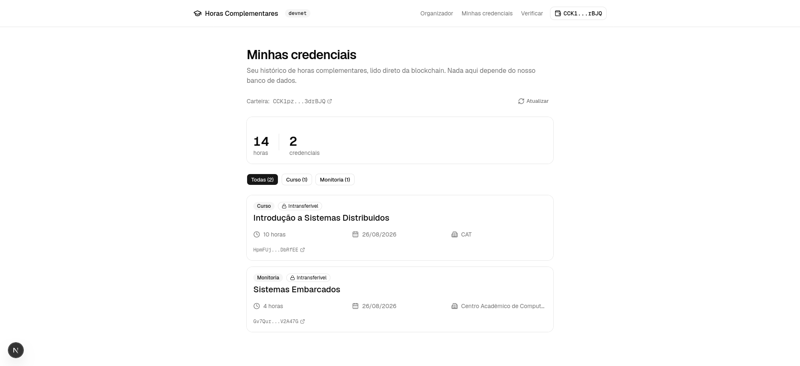
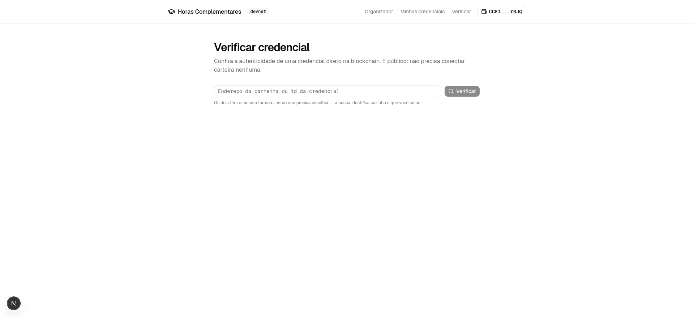

# Horas Complementares on-chain

Credenciais verificáveis de horas complementares emitidas na **Solana devnet**.

Toda graduação no Brasil exige horas complementares — palestras, cursos, monitorias, eventos
de extensão. Hoje a comprovação é manual: o aluno guarda o PDF do certificado, sobe num portal,
escolhe uma categoria e espera a coordenação aprovar. É lento, burocrático e fácil de perder o
comprovante pelo caminho.

Aqui, quem organiza a atividade faz o check-in dos participantes na hora, e isso emite
automaticamente uma credencial digital na carteira Solana do aluno. O aluno acumula um histórico
verificável, e qualquer pessoa confere a autenticidade publicamente — sem PDF, sem portal,
sem intermediário.

> **MVP de portfólio.** Roda 100% na devnet. Nenhum valor real é movimentado em momento algum,
> e não existe caminho de configuração para mainnet.

> **Não conhece blockchain?** O [CONCEITOS.md](./CONCEITOS.md) explica do zero cada peça
> usada aqui — blockchain, carteira, NFT, mint, Collection — e por que cada uma foi escolhida
> para este projeto. Não é preciso ler antes: o resto deste README se entende sozinho.

## Como funciona

1. **O organizador cria a atividade** — nome, categoria, carga horária, data e emissor. O sistema
   gera um QR code de check-in.
2. **O aluno faz check-in na hora** — escaneia o QR pelo celular, conecta a carteira e recebe a
   credencial na mesma hora.
3. **Qualquer um verifica** — a credencial vive na blockchain, com link direto pro Solana Explorer.

## As telas

### Início



Explica o problema em poucas linhas e conecta a carteira. O selo `devnet` no cabeçalho está
sempre visível — é um lembrete de que nada ali envolve dinheiro real. Depois de conectar, o
endereço aparece na tela com link para o Solana Explorer.

### Organizador — criar atividade



Quem organiza preenche nome, categoria, carga horária, data e emissor. Esses dados são
exatamente o que vai gravado dentro da credencial de cada participante, então é a única tela
onde alguém digita algo. Ao salvar, o app gera um link de check-in e um QR code para projetar
ou imprimir no evento.

> **Fase 6, não implementada:** o QR de hoje é um link comum. Trocá-lo por um QR de Solana Pay
> (Transaction Request) era a fase opcional do escopo e ficou de fora.

### Check-in — o aluno recebe a credencial



O aluno escaneia o QR, confere os dados da atividade e clica em "receber credencial". A tela é
mobile-first porque na prática ela é aberta no celular, em pé, durante o evento.

O detalhe que mais importa aqui: **o aluno não paga nada e não assina transação nenhuma.** Quem
paga a taxa e assina é a carteira do app, no servidor. Do lado do aluno, é um clique — a carteira
nem chega a abrir pedindo aprovação.



A confirmação traz três links para o Solana Explorer, e cada um prova uma coisa diferente:
a **credencial** (o ativo em si), a **transação** que a criou, e o **emissor** — a Collection à
qual ela pertence, que é o que distingue uma credencial real de um NFT qualquer que alguém
mintasse com o mesmo nome.

Clicar de novo em "receber credencial" não emite uma segunda: a tela informa que a carteira já
tem aquela credencial e mostra o link da existente.

### Minhas credenciais



O histórico do aluno, com o total de horas somado e um filtro por categoria — o filtro só
aparece quando há mais de uma categoria, para não ocupar espaço à toa.

Tudo nesta tela é lido **direto da blockchain** via DAS API, não do banco de dados. O selo
"Intransferível" em cada card não é enfeite: reflete o estado real do ativo on-chain.

### Verificação pública



A única tela que não pede carteira nenhuma — é para a coordenação, o RH, ou qualquer pessoa
conferindo um certificado.

O campo aceita tanto um endereço de carteira quanto o id de uma credencial. Os dois são chaves
base58 de 32 bytes e **não dá para distinguir pelo formato**, então a busca tenta interpretar
como credencial primeiro e cai para carteira se não casar — quem usa não precisa escolher.

### A prova on-chain

O Solana Explorer ainda tem suporte fraco a Metaplex Core — chega a rotular um ativo Core como
"compressed NFT" e não mostra a Collection. Por isso a verificação real deste projeto não depende
dele: os dados vivem no plugin `Attributes`, e qualquer RPC com DAS API os devolve.

Uma credencial emitida, consultada via `getAsset`:

```
interface  : MplCoreAsset
owner      : 7xJSTkKcgy2PxmgBLm8xTLb7NosQjZGmmwNFyabusn8c
grouping   : [{ group_key: "collection",
                group_value: "3FpUQLR4JpAPTRJrkUvdq6fnJQoCqnfJeZXYUi5MiwMA" }]
plugins    : ["attributes", "permanent_freeze_delegate"]
attributes :
    categoria    = Palestra
    cargaHoraria = 4
    data         = 26/08/2026
    emissor      = Coordenação de Ciência da Computação
    atividadeId  = cmta7umv80000gtb6tgyy3z57
```

E a intransferibilidade não foi deduzida de um nome de campo — foi testada. Tentando transferir
com o dono legítimo, com saldo e assinando corretamente, o programa on-chain recusa:

```
Program CoREENxT6tW1HoK8ypY1SxRMZTcVPm7R94rH4PZNhX7d invoke [1]
Program log: Instruction: Transfer
Program log: programs/mpl-core/src/plugins/internal/permanent/permanent_freeze_delegate.rs:58:Reject
Program log: Error: Custom program error: 0x9
```

## Stack

- **Next.js 16** (App Router) + TypeScript + Tailwind CSS v4
- **shadcn/ui** para os componentes
- **Solana devnet** via `@solana/web3.js` + `@solana/wallet-adapter-react`
- **Metaplex Core** (`@metaplex-foundation/mpl-core` via Umi) para mintar cada credencial
- **Helius DAS API** para listar os ativos de uma carteira
- **Prisma + SQLite** para as atividades criadas antes do check-in

### Três decisões de arquitetura

**Collection Core como carimbo do emissor.** Todo ativo é mintado dentro de uma única Core
Collection cuja authority é o app. Assim a listagem filtra por `grouping: ['collection', ...]`
na DAS API, sem depender de heurística de nome ou metadados para saber o que este app emitiu.

**Dados da atividade on-chain, no plugin Attributes.** Categoria, horas, data e emissor não vivem
só no JSON off-chain — vão para o plugin `Attributes` do Core. A verificação pública lê a fonte
on-chain e continua funcionando mesmo que o servidor de metadados saia do ar.

**Credencial soulbound, via PermanentFreezeDelegate.** Um certificado que pudesse ser vendido não
comprovaria nada — bastaria comprar as horas de outra pessoa. Cada ativo carrega o plugin
`PermanentFreezeDelegate`, e a recusa foi verificada na prática, não deduzida de um nome de campo:
o dono legítimo, com saldo e assinando corretamente, tem a transferência rejeitada pelo programa
on-chain em `permanent_freeze_delegate.rs` (`custom program error 0x9`).

## Rodando na sua máquina

Passo a passo completo, do zero. Nada aqui custa dinheiro: tudo roda na devnet da
Solana, e as duas contas externas usadas (Helius e faucet) têm plano gratuito sem
cartão de crédito.

### 0. O que você precisa antes

- **Node.js 20.9 ou mais novo** — confira com `node -v`. Se não tiver,
  instale em [nodejs.org](https://nodejs.org).
- **Git**, para clonar o repositório.
- **Uma extensão de carteira Solana** no navegador. [Phantom](https://phantom.app/download)
  e [Solflare](https://solflare.com/download) funcionam; qualquer carteira compatível
  com o padrão Wallet Standard é detectada automaticamente, não há lista fixa no código.

> **Crie uma carteira nova, não importe uma que você já use.** Este projeto é de teste
> e a carteira aqui é descartável.

### 1. Clonar e instalar

```bash
git clone https://github.com/andreluizcle/horas-complementares-blockchain.git
cd horas-complementares-blockchain
npm install
```

O `npm install` já roda `prisma generate` sozinho no final.

### 2. Criar o arquivo de configuração

```bash
cp .env.example .env
```

As próximas etapas vão preenchendo esse arquivo. Ele **nunca** vai para o Git —
contém a chave privada que assina as emissões.

### 3. Pegar uma chave da Helius

A Helius é o serviço que responde "quais credenciais essa carteira tem" sem precisar
varrer a blockchain inteira. O plano gratuito basta.

1. Crie uma conta em [helius.dev](https://helius.dev) (não pede cartão).
2. No painel, copie a **API Key** do projeto.
3. Cole no `.env`:

```
HELIUS_API_KEY=sua-chave-aqui
```

### 4. Gerar a carteira que emite as credenciais

Esta é a carteira do *app*, não a sua — é ela que paga as taxas de emissão, para que
o aluno não precise ter SOL nem assinar nada.

```bash
npm run keypair:new
```

O script gera a chave, grava no `.env` e imprime o endereço público. Se já houver uma
chave lá, ele não sobrescreve.

### 5. Abastecer essa carteira com SOL de devnet

SOL de devnet não vale dinheiro — serve só para pagar as taxas da rede de teste.

1. Copie o endereço público que o passo anterior imprimiu.
2. Abra [faucet.solana.com](https://faucet.solana.com), escolha a rede **devnet**,
   cole o endereço e peça o SOL.
3. Confira que chegou:

```bash
npm run wallet:status
```

Cada emissão custa cerca de **0.0035 SOL**, então mesmo 0.05 SOL já dão dezenas de
credenciais. Se o faucet oficial estiver seco, dá para usar o "get test SOL" da própria
Phantom em modo devnet e transferir para esse endereço.

### 6. Criar a Collection

A Collection é o "carimbo" do emissor: todo ativo é mintado dentro dela, e é isso que
permite provar depois que uma credencial saiu deste app, e não de qualquer um.

```bash
npm run collection:create
```

Rode **uma única vez**. O script imprime o endereço; cole no `.env`:

```
COLLECTION_ADDRESS=endereco-impresso-pelo-script
```

> Criar uma segunda Collection faria as credenciais antigas deixarem de ser reconhecidas,
> porque elas continuariam apontando para a primeira. O script se recusa a rodar se a
> variável já estiver preenchida.

### 7. Criar o banco e subir o app

```bash
npx prisma migrate deploy
npm run dev
```

Abra [http://localhost:3000](http://localhost:3000).

### 8. Colocar a carteira em devnet

Antes de conectar, mude a rede na extensão — senão ela não vai enxergar nada.
Na Phantom: *Configurações → Developer Settings → Testnet Mode → Solana Devnet*.

### 9. Testar o fluxo inteiro

1. Em `/organizador`, crie uma atividade.
2. Abra o link de check-in que aparece (ou escaneie o QR pelo celular, usando o
   endereço de rede que o `npm run dev` imprime, algo como `http://192.168.0.10:3000`).
3. Conecte a carteira e clique em **receber credencial**. Você não deve assinar nada.
4. Veja o resultado em `/minhas-credenciais`.
5. Cole seu endereço em `/verificar` — de preferência numa janela anônima, para
   confirmar que a verificação funciona sem carteira nenhuma conectada.

### Se algo der errado

| Sintoma | Causa provável |
|---|---|
| "Nenhuma carteira Solana detectada" | Extensão não instalada, ou a página não foi recarregada depois de instalar |
| A emissão falha dizendo que falta SOL | A carteira do app secou — rode `npm run wallet:status` e abasteça de novo |
| Erro citando `COLLECTION_ADDRESS` | O passo 6 não foi feito, ou o endereço não foi colado no `.env` |
| Erro de RPC ou "acesso recusado" | `HELIUS_API_KEY` ausente, errada ou expirada |
| A imagem da credencial não aparece na carteira | Esperado em `localhost` — veja *Limitações conhecidas* |
| Páginas com erro depois de trocar o banco | Apague a pasta `.next` e suba de novo; o cache de build guarda o adapter antigo |

### Variáveis de ambiente

| Variável | Descrição |
|---|---|
| `APP_KEYPAIR_SECRET` | Keypair de devnet (base58) que paga as taxas de mint. **Server-only** — nunca prefixe com `NEXT_PUBLIC_`. |
| `HELIUS_API_KEY` | Chave gratuita da [Helius](https://helius.dev) para a DAS API |
| `COLLECTION_ADDRESS` | Endereço da Core Collection, gerado uma vez por script |
| `DATABASE_URL` | Caminho do SQLite local. Padrão: `file:./prisma/dev.db` |
| `NEXT_PUBLIC_RPC_URL` | Opcional. Sem isso, usa o RPC público de devnet. **Nunca** ponha aqui a URL da Helius: ela contém a chave, e variáveis `NEXT_PUBLIC_` vão para o navegador. |

## Publicando (ainda não feito)

O projeto roda hoje **apenas localmente**. Publicar exige um passo que não está
feito: **trocar o SQLite por um Postgres**.

O motivo é que plataformas como a Vercel rodam o código em ambientes efêmeros,
onde o sistema de arquivos é descartado entre requisições — um banco em arquivo
não sobrevive ali, e o `dev.db` nem é versionado. A troca foi tentada e revertida
por ora, já que a publicação ficou para depois. O que ela envolve:

1. `provider = "postgresql"` no `prisma/schema.prisma`, migration inicial regerada
   (a atual é SQL de SQLite) e `@prisma/adapter-pg` no lugar do de SQLite em
   `src/lib/prisma.ts`. Nenhuma outra parte do código muda.
2. `prisma migrate deploy` antes do `next build`, para o schema ser aplicado no deploy.
3. `APP_KEYPAIR_SECRET`, `HELIUS_API_KEY` e `COLLECTION_ADDRESS` configurados como
   variáveis de ambiente na plataforma. Nenhuma leva o prefixo `NEXT_PUBLIC_`.
4. Se o Postgres escolhido usar pooler em modo *transaction* (o caso do Supabase na
   porta 6543), as migrations precisam de uma conexão direta separada — poolers nesse
   modo não suportam as travas que o `prisma migrate` usa.

Publicar também resolve sozinho uma limitação atual: o `uri` de cada credencial é
montado a partir da URL da requisição, então em produção a imagem da credencial passa
a renderizar na carteira e no Explorer, o que em `localhost` não acontece.

> A Collection é criada uma vez, por script, e vale para qualquer ambiente:
> o mesmo `COLLECTION_ADDRESS` local e em produção. Não rode
> `collection:create` de novo ao publicar, senão as credenciais antigas
> ficam fora da collection nova e param de ser reconhecidas.

## Status

- [x] **Fase 1** — Base do projeto, conexão de carteira em devnet
- [x] **Fase 2** — Organizador cria atividade, gera link e QR de check-in
- [x] **Fase 3** — Check-in e emissão da credencial Metaplex Core (soulbound, dentro da collection)
- [x] **Fase 4** — Carteira do aluno, total de horas e filtro por categoria
- [x] **Fase 5** — Verificação pública, sem carteira
- [ ] **Fase 6** — Check-in via Solana Pay *(opcional)*

## Limitações conhecidas

Este é um MVP de portfólio, e vale ser explícito sobre onde ele para:

- **Sem regras de permissão.** Qualquer carteira conectada cria atividades como organizador.
  Isso estava fora do escopo de propósito — num sistema real, emitir credencial em nome de uma
  instituição exigiria autorização de verdade.
- **Rodando em `localhost`, a imagem da credencial não aparece** na carteira nem no Explorer,
  porque nenhum dos dois consegue acessar o `uri` apontando para a sua máquina. Os dados que
  provam a credencial estão on-chain e aparecem normalmente. Publicado, isso se resolve sozinho.
- **Roda só localmente.** O banco é SQLite em arquivo, que não sobrevive em hospedagem
  serverless — publicar exige migrar para Postgres antes (veja a seção acima).
- **Fase 6 (Solana Pay) não implementada** — era opcional no escopo original.

## Nota sobre `npm audit`

O audit reporta avisos que foram investigados um a um, e nenhum representa risco real aqui:

- **Moderados, de `uuid@8.3.2`** — puxado transitivamente por `jayson` ← `@solana/web3.js`.
  O advisory afeta apenas as funções `v3/v5/v6` quando recebem o argumento `buf`; o `jayson`
  usa somente `uuid.v4()` sem argumentos, então o caminho vulnerável nunca é executado. Não há
  correção a montante — depende do `jayson` atualizar o pin.
- **Altos, de `deepmerge-ts`** — puxado por `@prisma/config` ← `prisma`, que é
  **devDependency**: é a CLI do Prisma, nunca vai para o runtime em produção. O advisory é de
  stack exhaustion ao mesclar grafos de objetos recursivos, e a config deste projeto é um objeto
  pequeno e estático.
